# Hash functions

Pre-requisites: none

## Introduction

A hash function is a that converts any data to a string of fixed length. The
output of this function is often writen as hexadecimal.

A proper hash function must follow these requirements:

- The outputs must ways be the same size
- If same input is given to tha function, it must produces the same result
  (hash value)
- If a similar input, even if different by only 1 bit, must produces a
  completely different output
- Completely different files can produces same hash value, but this should be
  as unlikely as possible.
- The conversion in the oposite (from hash value to original file) way must be very difficult

## References

https://en.wikipedia.org/wiki/Hash_function
